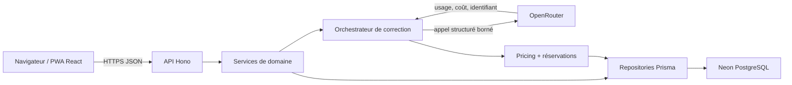
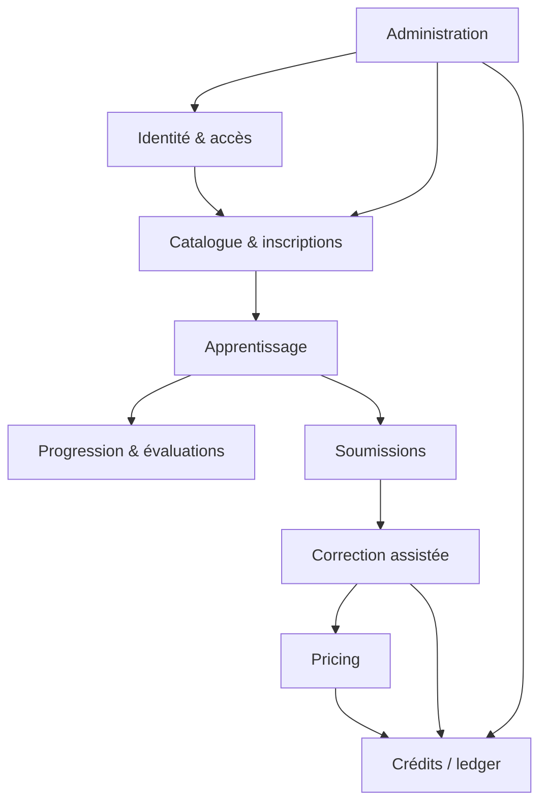
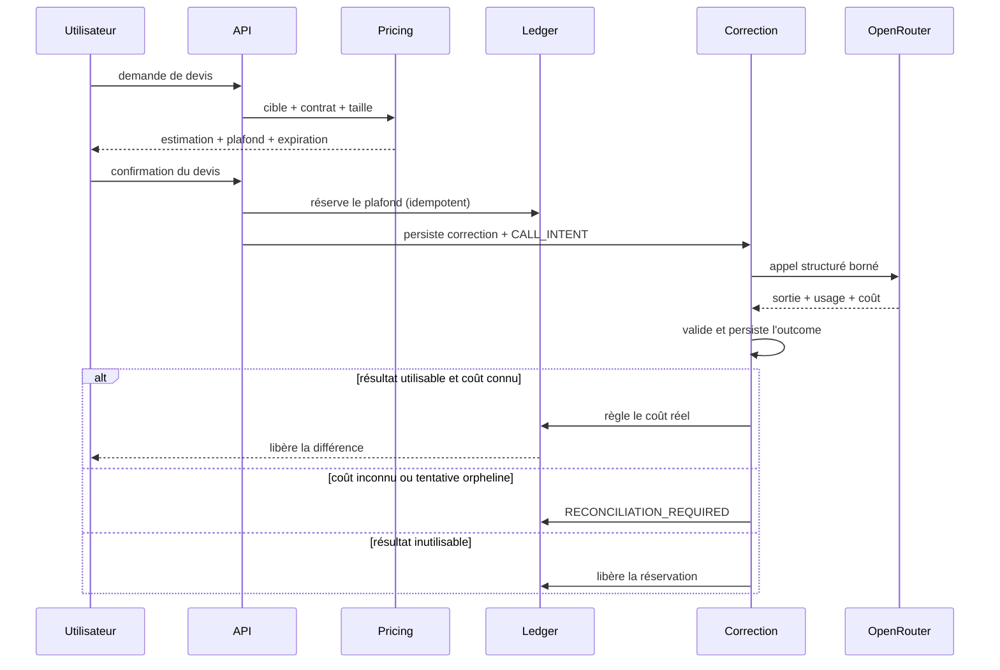

# Architecture LearnX V4.1

## Vue système



Le navigateur n'est jamais l'autorité des scores, de la progression, des
permissions, du pricing ou du ledger. L'API valide les entrées, les services
appliquent les règles et les repositories isolent la persistance.

## Frontend

- `src/app/` : racine React, providers, routeur et navigation.
- `src/components/ui/` : primitives shadcn/Radix possédées par LearnX.
- `src/components/learnx/` et compositions de domaine : assemblages
  réutilisables qui conservent le langage LearnX.
- `src/features/` : modèles client, hooks React Query et vues spécialisées.
- `src/pages/` : limites de routes ; une page compose, elle ne porte pas la
  logique métier serveur.
- `src/i18n/` et styles de domaines : catalogues et présentation.

React Router conserve les URL V4. Les pages sont chargées paresseusement.
React Query possède le cache réseau et ses invalidations ; aucun store métier
client ne remplace les autorités serveur.

## Backend

`src/server/api/app.ts` monte les modules Hono. Les modules décomposés suivent
la chaîne :

```text
route → validation → service → repository
```

Les préoccupations transversales (authentification, autorisation, erreurs,
observabilité et pagination) vivent dans `src/server/api/_lib/`. Les domaines
à forte intégrité possèdent en plus leurs modules dédiés sous `src/server/` :
corrections, pricing, credits, maintenance et adaptateurs IA.

## Dépendances des domaines



Les flèches indiquent une dépendance autorisée, pas un droit d'écriture
implicite. En particulier, une correction assistée ne modifie jamais la
progression. Les contrôles d'import V4.1 bloquent cycles et frontières
interdites.

## Données et Prisma

`prisma/schema.prisma` contient generator et datasource. Les modèles sont
classés par domaine dans `prisma/models/*.prisma`. Ce rangement n'a pas produit
de migration SQL et ne change aucun nom de table ou contrat V4.

Domaines de schéma : identité/accès, catalogue, runtime d'apprentissage,
évaluations/progression, correction IA et crédits/pricing. Les dates sont en
UTC. La hiérarchie pédagogique reste strictement
`Program > Stage > Module > Lesson`.

## Cycle correction et réservation



Le débit final ne dépasse jamais le plafond accepté. Un coût absent n'est
jamais reconstruit comme zéro. L'historique et les replays sont idempotents.

## Déploiement

Le frontend est construit par Vite et livré comme PWA. L'API Hono s'exécute
sur les fonctions du déploiement. Neon porte PostgreSQL ; OpenRouter n'est
appelé que par le serveur et uniquement sous une identité runtime promue.
Secrets et URLs de base ne sont ni exposés au navigateur ni committés.

## Frontières non négociables

- aucun changement de données pour faciliter une migration UI ;
- aucun score ou calcul de progression côté client ;
- aucun import direct d'un repository dans une route quand un service existe ;
- correction, pricing, ledger et réconciliation restent séparés ;
- artefacts de recherche hors runtime ;
- absence de Preact et d'un second routeur ;
- toute mutation idempotente et toute erreur normalisée.
