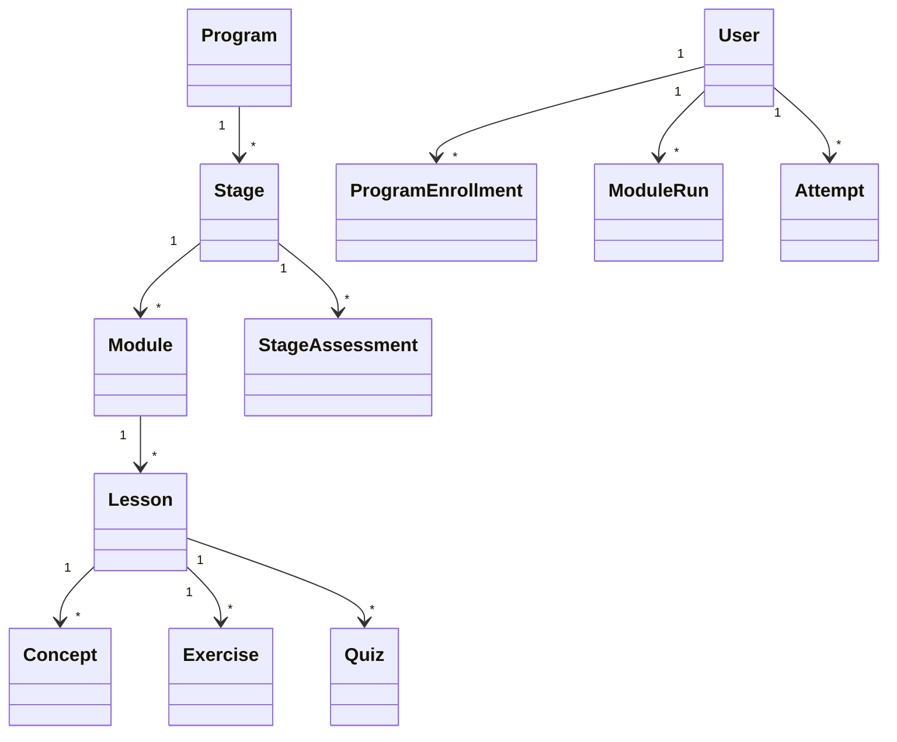
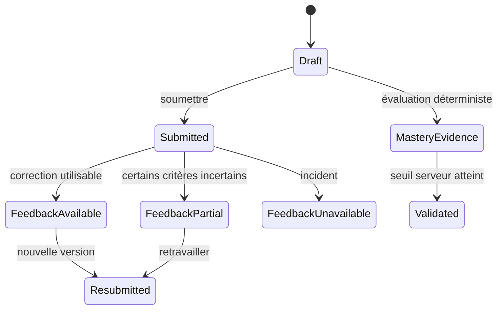
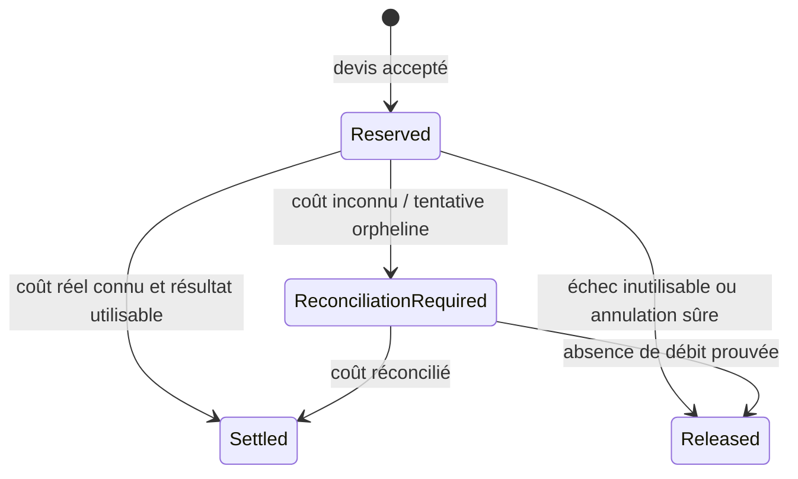

# Modèle de domaine LearnX

## Autorités

| Information | Autorité |
| --- | --- |
| Structure et contenu publiés | Modèles serveur et version de programme |
| Inscription et accès | Serveur, session et politiques d'autorisation |
| Progression et maîtrise | Calculs serveur et tentatives persistées |
| Devis et plafond | Catalogue pricing actif et devis immuable |
| Solde, réservation, règlement | Ledger append-only et lots de crédits |
| Correction publiée | Résultat persisté validé par l'orchestrateur |
| Preuves scientifiques IA | Artefacts versionnés ; jamais le runtime seul |

## Apprentissage

La durée est indicative et ne crée aucune année académique ni semestre. Une
ressource consultée ne valide pas une notion. Toute notion obligatoire a une
évaluation et toute étape publiée une évaluation finale.

## Remise, feedback et maîtrise

Ces états sont séparés :

- **remise** : une production a été enregistrée ;
- **feedback** : une correction formative peut être disponible, partielle ou
  indisponible ;
- **maîtrise** : une autorité d'évaluation serveur a validé les exigences.

Une correction IA formative ne produit pas automatiquement `VALIDATED` et ne
modifie ni `ConceptProgress` ni `StageProgress`.

## Correction assistée

Une cible est une `ExerciseSubmission` ou, lorsque le contrat l'autorise, une
`StageAssessmentSubmission`. Le devis précède l'exécution. La correction
contient des résultats par critère, des preuves issues de la réponse, un
feedback et éventuellement un score indicatif serveur.

États publiables :

- `COMPLETED` : tous les critères publiés sont utilisables ;
- `COMPLETED_PARTIAL` : les critères fiables sont livrés et les autres sont
  explicitement incertains ; aucun score exact trompeur ;
- `FAILED` : aucun résultat pédagogique utilisable.

Une contestation argumentée est une action distincte, bornée et historisée ;
elle ne réécrit jamais la correction source.

## Pricing, crédits et finance

Un devis immuable fixe estimation, plafond, modèle, prompt, contrat, cible et
expiration. Le ledger représente des lots distincts, notamment offerts et
achetés. Le total affiché est dérivé ; l'origine n'est jamais perdue.

La ventilation d'une réservation est figée. Un règlement inférieur libère la
différence. Un dépassement du plafond est absorbé par LearnX et signalé.

## Identité et autorisation

`User`, session, rôle et accès programme sont distincts. Les routes protégées
vérifient la session ; les capacités admin sont calculées côté serveur. Une
page masquée dans l'UI n'est jamais une autorisation.

## Administration

L'administration gère demandes d'accès, comptes, programme/catalogue,
contacts publics et crédits dans des services séparés. Toute mutation sensible
est auditée, datée en UTC et idempotente. Les changements de contenu ou de
visibilité n'altèrent pas implicitement les crédits ou la progression.

## Frontières de versions

- V4.1 : refondation technique à contrats constants.
- V4.5 : qualité IA suivante, quatre familles, longues réponses,
  contestations/comparaisons, évaluations textuelles et commerce.
- V5 : création guidée sourcée et analytics de première partie.
