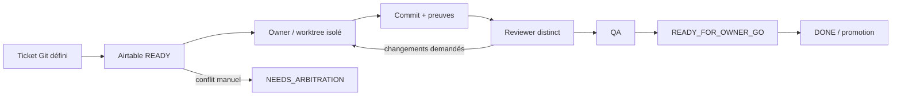

# Conventions d'ingénierie LearnX

## Structure et dépendances

- TypeScript strict ; aucun `any` sans justification documentée.
- Imports absolus depuis `@/` dans l'application.
- Une route valide, un service décide, un repository persiste.
- Les composants React restent fonctionnels et la logique métier serveur reste
  hors des composants.
- `components/ui` contient les primitives shadcn possédées ;
  `components/learnx` et les composants de domaine contiennent les compositions.
- Une feature peut dépendre de primitives partagées, jamais d'une page sœur.
- Les recherches et runners expérimentaux restent hors du runtime produit.

Le gate `quality:imports:v4.1` bloque Preact, cycles et frontières interdites.
`knip` bloque dépendances, fichiers et exports inutilisés non justifiés.

## Règles anti-monolithes

- source TS/TSX manuscrite : cible ≤ 400 lignes ;
- test : cible ≤ 600 lignes ;
- fonction : cible ≤ 80 lignes ;
- exception uniquement avec raison, owner et ticket de réduction ;
- fichiers générés, seeds et artefacts bruts exclus mais déclarés.

Le noyau du résumé de benchmark respecte désormais des modules distincts :
support, décisions, observations, analyse et modèle final. Les tests goldens
protègent la parité scientifique du découpage.

## React, shadcn et styles

- React 19 est l'unique runtime UI.
- React Router gère les URLs ; React Query gère le cache réseau.
- Les primitives shadcn/Radix sont du code LearnX : les adapter localement est
  autorisé, les dupliquer dans une feature ne l'est pas.
- Maia fournit géométrie et espacement ; DM Sans et les tokens LearnX gardent
  l'identité.
- Lucide sert aux icônes utilitaires ; les actifs de marque restent dédiés.
- Tailwind 4 et les tokens sont préférés aux valeurs ponctuelles.
- Pas de dark mode, Aceternity ou nouvelle fonctionnalité produit en V4.1.

Toute surface interactive possède libellé accessible, focus visible, clavier,
cible tactile, état loading/vide/erreur et comportement reduced motion adapté.

## API, erreurs et persistance

- Les payloads et réponses sont typés et validés avec Zod aux frontières.
- Les erreurs sont normalisées ; aucune mutation silencieuse.
- Les dates sont stockées en UTC.
- Les mutations sensibles utilisent clés d'idempotence et transactions lorsque
  plusieurs écritures forment une seule opération.
- Aucun secret, texte utilisateur réel ou URL de base dans les logs/commits.
- Le découpage Prisma multi-file ne justifie aucune migration SQL.

## Correction et finance

- CALL_INTENT est persisté avant le réseau.
- Coût inconnu implique `RECONCILIATION_REQUIRED`, jamais zéro.
- Un devis accepté est immuable ; le débit ne dépasse pas le plafond.
- Un retry technique est borné et ne crée pas une seconde vente.
- Une lecture d'historique ne réserve aucun crédit.
- Les résultats IA ne modifient pas la progression.

## Tests

Chaque bug corrigé obtient un test à la couche la plus proche de sa cause. Les
contrats de domaine utilisent des tests unitaires ; les repositories, des tests
d'intégration sur branche Neon jetable ; les parcours, Playwright. Ne pas
modifier une baseline ou ignorer un test pour fabriquer un GO.

## Git et agents

Un ticket a un owner, un reviewer distinct et un seul lot d'implémentation en
cours par agent. Travail sur branche/worktree depuis `origin/dev`. Aucun push
direct sur `main`. Le handoff inclut base, SHA, fichiers, tests, limites et
rollback. Le détail Git ↔ Airtable est dans `docs/AGENT_WORKFLOW.md`.

## Definition of Done

- critères couverts ;
- lint, typecheck, tests proportionnés et build verts ;
- documentation utile mise à jour ;
- aucun risque connu masqué ;
- diff contrôlé et fichiers générés exclus ;
- preuve immuable remise au reviewer ;
- statut Airtable synchronisé seulement après relecture ciblée.
