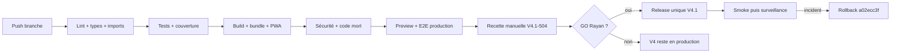

# Tests et release LearnX V4.1

## Stratégie

| Niveau | Objet | Outil |
| --- | --- | --- |
| Unitaire | règles, composants et contrats | Vitest + Testing Library React |
| Intégration | transactions, repositories, permissions et concurrence | Playwright/runner sur branche Neon jetable |
| E2E développement | routes, responsive, accessibilité et catalogues internes | Playwright multi-projets |
| E2E production | bundle livré, sans routes de design | Playwright production config |
| Références visuelles | dérive visuelle d'un changement de design system | Playwright `toHaveScreenshot`, pré-vol local |
| Statique | types, lint, imports, cycles et code mort | TypeScript, ESLint, contrôle imports, knip |
| Supply chain | vulnérabilités de production | `pnpm audit --prod` |

## Gates reproductibles

```bash
pnpm prisma:generate
pnpm lint
pnpm typecheck
pnpm test
pnpm test:coverage:v4.1
pnpm quality:coverage:critical
pnpm quality:dead-code
pnpm build
pnpm quality:bundle
pnpm quality:security
pnpm test:e2e:production
```

La chaîne consolidée est `pnpm quality:v4.1:final`. Elle exige 80 % sur les
quatre métriques globales et 90 % lines sur auth/accès,
correction/pricing/crédits/réconciliation, progression/évaluations et
autorisations admin.

## Références visuelles

`pnpm test:visual` compare 30 captures — landing, connexion, demande d'accès, 404,
Aujourd'hui, Mes parcours, Découvrir, programme, leçon et notes — à 390, 768 et
1440 px. Les surfaces authentifiées réutilisent le mock déterministe
`tests/e2e/journey-api.ts`, donc les pixels ne dépendent d'aucune base.

C'est un **gate CI bloquant**, exécuté par `.github/workflows/visual.yml` sur
chaque pull request et chaque push sur `dev`. Les références versionnées sont
générées sur Linux par ce même workflow.

Conséquence à connaître : **`pnpm test:visual` échoue sur macOS, par
construction**. Il compare des pixels Linux à un rendu macOS ; ce n'est pas une
régression. Le pré-vol local n'existe plus sous cette forme.

Usage pendant un travail de design :

```bash
# voir son propre écart : pousser la branche, lire l'artefact `visual-diff`
gh run watch                  # le job échoue et joint les images de différence

# accepter un changement, après avoir compris pourquoi les pixels ont bougé
gh workflow run visual.yml --ref <branche> -f update=true
gh run download <run-id> -n visual-baselines -D /tmp/b
cp -R /tmp/b/. tests/visual/__screenshots__
```

Une seule série de références a été retenue plutôt que des références par
plateforme : deux séries devraient être régénérées ensemble à chaque changement
de design, et le système que cette suite protège existe précisément parce que
des valeurs dupliquées finissent par diverger.

La tolérance est calibrée : `threshold: 0.01` par pixel et un ratio de
`0.0005`. Elle a été vérifiée dans les deux sens — un simple changement d'accent
de marque (`#3b5bd6` → `#4F52D9`) fait échouer les 10 captures d'un projet, et
une exécution sans changement reste verte. Une tolérance plus permissive
masquait exactement ce changement.

## Environnements

- Vitest : jsdom et doubles typés ; aucun service payant.
- E2E local : API interceptée pour vérifier le navigateur.
- Intégration : branche Neon copy-on-write jetable, protégée par identifiants
  d'environnement ; suppression vérifiée après le run.
- Preview finale : configuration proche production, données de recette et
  secrets externes ; aucune donnée utilisateur réelle dans les fixtures.

## Pipeline CI et release



Le contexte externe `Quality / V4.1 final (required)` doit être rendu
obligatoire sur `dev` avant le GO. Le dépôt prouve le job, pas le réglage de
protection de branche.

### Seaux de limitation : secret obligatoire

`LEARNX_BUCKET_HMAC_SECRET` doit être défini en production. Les seaux de
limitation et d'anti-abus sont indexés sur une empreinte HMAC de l'adresse IP
ou de l'e-mail : un SHA-256 nu d'une adresse IPv4 se retrouve par table sur les
2^32 valeurs de l'espace, donc l'empreinte non salée rangeait l'adresse au lieu
de la protéger.

Aucun contrôle dédié n'est nécessaire : sans le secret, `readBucketHmacSecret`
refuse en production, la connexion échoue avant l'authentification, et le
contrôle de déploiement tombe — avant le trafic. Le défaut connu de
développement est publié exprès et ne protège rien.

### Migrations : gardes de catalogue

Toute garde `IF NOT EXISTS` interrogeant un catalogue système doit être
qualifiée par le schéma courant : `pg_type` par une jointure sur `pg_namespace`
avec `n.nspname = current_schema()`, `pg_constraint` par
`conrelid = '<table>'::regclass`.

Sans cette qualification, l'étape « rejeu de l'historique complet dans un
schéma isolé » d'Integration trouve l'objet dans `public`, saute sa création,
et soit échoue sur l'instruction qui le référence, soit — pire — diverge en
silence. Une garde non qualifiée passe l'application initiale et ne casse
qu'au rejeu : le test qui l'attrape n'est pas celui qu'on regarde en écrivant
la migration.

## Recette obligatoire V4.1-504

1. Déployer le SHA candidat exact en preview et le consigner.
2. Rejouer demande d'accès, activation, connexion/déconnexion et permissions.
3. Parcourir Today → programme → étape → module → leçon, notes et révisions.
4. Rejouer exercice, devis, confirmation, résultat complet/partiel,
   contestation, historique et comparaison.
5. Vérifier réservation, règlement, libération et coût inconnu fail-close.
6. Contrôler crédits utilisateur et administration.
7. Installer la PWA sur appareil, tester offline/update.
8. Contrôler 320/390/720/1440/1920, zoom navigateur 200 %, clavier et lecteur
   d'écran ; aucune couleur comme seul signal.
9. Répéter un rollback vers `a02ecc3f…`, puis restaurer la preview candidate.
10. Enregistrer preuves, divergences et décision propriétaire.

## Quota de déploiements Vercel

Le plan Hobby autorise **100 déploiements par jour**. Le 29 août 2026 la limite
a été atteinte : environ cinquante pull requests et quarante-cinq merges ont
produit chacun un déploiement, et les previews qui comptent — `dev`, et la
passe de paiement — n'ont plus pu se construire. Le volume vient des branches
de travail ; la valeur est sur la ligne de promotion.

Seules `dev`, `staging` et `main` déclenchent donc un build, via l'« Ignored
Build Step » de Vercel. Un déploiement de production construit toujours, quelle
que soit la branche.

**La règle vit dans le réglage du projet Vercel**, Settings → Git → Ignored
Build Step → Custom, et nulle part ailleurs. C'est la seule source de vérité :
`vercel.json` ne porte plus d'`ignoreCommand`, et `scripts/vercel-ignore-build.sh`
n'est plus qu'une copie de référence, lisible et exécutable, que rien n'appelle.

La première version faisait l'inverse — `ignoreCommand` pointait sur le script.
Cela ne pouvait pas fonctionner, et la raison mérite d'être retenue : une règle
portée par un fichier du dépôt ne gouverne pas une branche antérieure à ce
fichier. Sur une telle branche la commande s'exécute quand même, bash ne trouve
pas le script, sort en non-zéro — et dans cette convention inversée, non-zéro
veut dire **construire**. Le mécanisme échouait en s'ouvrant, précisément sur
les vieilles branches de travail qu'il devait arrêter. Un réglage de projet n'a
pas cet angle mort : il s'applique à toutes les branches, y compris celles
créées avant lui, parce qu'aucune branche ne le transporte.

Une branche de travail qui a réellement besoin d'un preview le demande en
mettant `[preview]` dans son message de commit. L'échappatoire vit ainsi dans
le commit qui en a besoin, et non dans un réglage que quelqu'un devra penser à
remettre.

Les checks GitHub sont inchangés : ne pas construire de preview ne retire ni
Quality, ni Integration, ni le gate visuel.

Rappel de polarité, qui se trompe facilement : dans un « Ignored Build Step »,
sortir **1** signifie « construire » et sortir **0** signifie « ignorer ».

## Gate visuel : ratio et plancher absolu

La comparaison de captures cumule deux plafonds, et Playwright retient le plus
strict des deux (`Math.min`).

- `maxDiffPixelRatio: 0.0005` suit l'aire de la capture. Il gouverne les
  petites captures.
- `maxDiffPixels: 300` est un plancher absolu. Il gouverne les grandes.

Le ratio seul rendait le gate d'autant plus aveugle que la page est longue.
Mesuré sur les références versionnées : `landing.png` en desktop-1440 fait
1440x4146, donc le ratio y tolérait 2 985 pixels différents — davantage qu'un
lien de pied de page entier, de l'ordre de 2 000 pixels — quand la plus petite
capture n'en tolérait que 164. Un facteur dix-huit d'écart de sévérité, décidé
par la seule hauteur de page.

Le symptôme observé sur V4.5-167 : l'ajout du lien « Confidentialité » au pied
de la landing ne faisait rougir que `mobile-390`. Desktop et tablette
absorbaient le changement sans rien signaler.

Le plancher ne peut que resserrer : il ne relâche jamais ce que le ratio
interdit déjà. Toute modification de ces deux valeurs se justifie par écrit
dans la revue, jamais par réflexe pour faire passer une suite rouge.

## Budgets

- JavaScript initial ≤ 125 kB gzip ;
- CSS initial ≤ 25 kB gzip ;
- plus gros chunk lazy et précache sous les seuils versionnés du script bundle ;
- 0 vulnérabilité haute/critique ;
- 0 dette P0/P1 ; chaque P2 a owner, impact et cible.

## Cibler une base autre que celle du `.env`

Règle mécanique, née de l'effacement de la base de production du 30 août 2026
(post-mortem : `docs/qa/V4_5_192_POSTMORTEM_BASE_PRODUCTION.md`).

`prisma.config.ts` compose sa source de données ainsi :

```ts
url: process.env.DIRECT_URL ?? process.env.DATABASE_URL ?? fallback
```

**`DIRECT_URL` gagne.** Surcharger la seule `DATABASE_URL` ne change donc pas
la cible des commandes destructrices — `db execute`, `migrate deploy`,
`migrate reset` — qui continuent d'utiliser la `DIRECT_URL` du `.env` courant.
C'est ainsi qu'une commande destinée à `preview` a supprimé le schéma de
production, sans erreur ni avertissement.

Poser les deux variables, ou aucune. Jamais une seule :

```bash
env -i PATH="$PATH" HOME="$HOME" \
  DATABASE_URL='<url poolée de la cible>' \
  DIRECT_URL='<url directe de la cible>' \
  pnpm prisma migrate deploy
```

`env -i` repart d'un environnement vide, ce qui empêche le `.env` du worktree
de fournir la variable oubliée.

## Contrôles planifiés

`.github/workflows/scheduled.yml`.

**Attention, et c'est le piège qui coûte une semaine :** GitHub n'enregistre
`schedule` et `workflow_dispatch` que depuis la **branche par défaut**. Ce
fichier ne fait strictement rien tant qu'il n'est pas sur `main` — il
n'apparaît même pas dans la liste des workflows et ne peut pas être déclenché à
la main. Ce n'est pas une erreur d'expression cron. Le balayage Neon de
V4.5-171 est resté inerte pour cette raison exacte.

### Smoke de production

Quatre fois par jour, et **après chaque déploiement de production**, parce que
« est-ce que ce déploiement a vraiment marché » est la question que personne ne
pense à poser. Deux étapes : `GET /api/health`, public et sans identifiants,
puis `pnpm deployment:check` authentifié. Si la première échoue, il est inutile
de s'authentifier pour en apprendre davantage.

C'est le seul travail planifié qui ne demande aucun identifiant de base.

### Opérations quotidiennes, fermées par défaut

`ai:cost-audit`, `trial:grant-cycle` et une simulation de `maintenance:cleanup`
tournent une fois par jour — **mais seulement si le propriétaire les ouvre**,
en posant la variable `LEARNX_SCHEDULED_DB_JOBS` à `true` **et** le secret
`LEARNX_PRODUCTION_DATABASE_URL`. L'un sans l'autre laisse le travail fermé
plutôt qu'à moitié exécuté, selon la même règle que les drapeaux applicatifs.

Cette fermeture par défaut est délibérée : ouvrir ces travaux revient à placer
un identifiant de production capable d'écrire dans GitHub Actions, le lendemain
du jour où une commande mal ciblée a vidé la base de production. C'est une
décision, pas un réglage.

Une alternative existe et mérite d'être pesée avant d'ouvrir : exposer ces
opérations comme des routes authentifiées appelées par un cron Vercel, ce qui
éviterait tout identifiant de base hors de Vercel. Le plan Hobby limite
fortement le nombre de crons, et les routes n'existent pas ; c'est un chantier,
pas un réglage.

`maintenance:cleanup` reste **en simulation** sur planification. Supprimer sur
minuterie est la façon dont une politique de rétention que personne ne relit
finit par retirer plus que prévu ; `--apply` demeure un acte délibéré.

## Rollback

V4.1 ne requiert pas de migration de données pour React/shadcn ou le découpage
Prisma. Le rollback applicatif redéploie la release V4
`a02ecc3f307af36656fa5cb8a7b62954fdec73e9`. Ne jamais utiliser un rollback
Git destructif sur un worktree local ; le déploiement cible un SHA immuable.

Pour la correction, suspendre les nouveaux dispatchs avant toute opération de
rollback si des tentatives restent `SENT`, `ORPHANED` ou sans coût. Réconcilier
chaque tentative avant règlement/libération définitifs.
