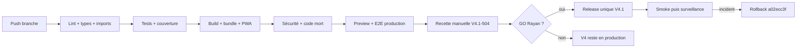

# Tests et release LearnX V4.1

## Stratégie

| Niveau | Objet | Outil |
| --- | --- | --- |
| Unitaire | règles, composants et contrats | Vitest + Testing Library React |
| Intégration | transactions, repositories, permissions et concurrence | Playwright/runner sur branche Neon jetable |
| E2E développement | routes, responsive, accessibilité et catalogues internes | Playwright multi-projets |
| E2E production | bundle livré, sans routes de design | Playwright production config |
| Références visuelles | dérive visuelle d'un changement de design system | Playwright `toHaveScreenshot`, pré-vol local |
| Statique | types, lint, imports, cycles et code mort | TypeScript, ESLint, contrôle imports, knip |
| Supply chain | vulnérabilités de production | `pnpm audit --prod` |

## Gates reproductibles

```bash
pnpm prisma:generate
pnpm lint
pnpm typecheck
pnpm test
pnpm test:coverage:v4.1
pnpm quality:coverage:critical
pnpm quality:dead-code
pnpm build
pnpm quality:bundle
pnpm quality:security
pnpm test:e2e:production
```

La chaîne consolidée est `pnpm quality:v4.1:final`. Elle exige 80 % sur les
quatre métriques globales et 90 % lines sur auth/accès,
correction/pricing/crédits/réconciliation, progression/évaluations et
autorisations admin.

## Références visuelles

`pnpm test:visual` compare 30 captures — landing, connexion, demande d'accès, 404,
Aujourd'hui, Mes parcours, Découvrir, programme, leçon et notes — à 390, 768 et
1440 px. Les surfaces authentifiées réutilisent le mock déterministe
`tests/e2e/journey-api.ts`, donc les pixels ne dépendent d'aucune base.

C'est un **gate CI bloquant**, exécuté par `.github/workflows/visual.yml` sur
chaque pull request et chaque push sur `dev`. Les références versionnées sont
générées sur Linux par ce même workflow.

Conséquence à connaître : **`pnpm test:visual` échoue sur macOS, par
construction**. Il compare des pixels Linux à un rendu macOS ; ce n'est pas une
régression. Le pré-vol local n'existe plus sous cette forme.

Usage pendant un travail de design :

```bash
# voir son propre écart : pousser la branche, lire l'artefact `visual-diff`
gh run watch                  # le job échoue et joint les images de différence

# accepter un changement, après avoir compris pourquoi les pixels ont bougé
gh workflow run visual.yml --ref <branche> -f update=true
gh run download <run-id> -n visual-baselines -D /tmp/b
cp -R /tmp/b/. tests/visual/__screenshots__
```

Une seule série de références a été retenue plutôt que des références par
plateforme : deux séries devraient être régénérées ensemble à chaque changement
de design, et le système que cette suite protège existe précisément parce que
des valeurs dupliquées finissent par diverger.

La tolérance est calibrée : `threshold: 0.01` par pixel et un ratio de
`0.0005`. Elle a été vérifiée dans les deux sens — un simple changement d'accent
de marque (`#3b5bd6` → `#4F52D9`) fait échouer les 10 captures d'un projet, et
une exécution sans changement reste verte. Une tolérance plus permissive
masquait exactement ce changement.

## Environnements

- Vitest : jsdom et doubles typés ; aucun service payant.
- E2E local : API interceptée pour vérifier le navigateur.
- Intégration : branche Neon copy-on-write jetable, protégée par identifiants
  d'environnement ; suppression vérifiée après le run.
- Preview finale : configuration proche production, données de recette et
  secrets externes ; aucune donnée utilisateur réelle dans les fixtures.

## Pipeline CI et release



Le contexte externe `Quality / V4.1 final (required)` doit être rendu
obligatoire sur `dev` avant le GO. Le dépôt prouve le job, pas le réglage de
protection de branche.

### Seaux de limitation : secret obligatoire

`LEARNX_BUCKET_HMAC_SECRET` doit être défini en production. Les seaux de
limitation et d'anti-abus sont indexés sur une empreinte HMAC de l'adresse IP
ou de l'e-mail : un SHA-256 nu d'une adresse IPv4 se retrouve par table sur les
2^32 valeurs de l'espace, donc l'empreinte non salée rangeait l'adresse au lieu
de la protéger.

Aucun contrôle dédié n'est nécessaire : sans le secret, `readBucketHmacSecret`
refuse en production, la connexion échoue avant l'authentification, et le
contrôle de déploiement tombe — avant le trafic. Le défaut connu de
développement est publié exprès et ne protège rien.

### Migrations : gardes de catalogue

Toute garde `IF NOT EXISTS` interrogeant un catalogue système doit être
qualifiée par le schéma courant : `pg_type` par une jointure sur `pg_namespace`
avec `n.nspname = current_schema()`, `pg_constraint` par
`conrelid = '<table>'::regclass`.

Sans cette qualification, l'étape « rejeu de l'historique complet dans un
schéma isolé » d'Integration trouve l'objet dans `public`, saute sa création,
et soit échoue sur l'instruction qui le référence, soit — pire — diverge en
silence. Une garde non qualifiée passe l'application initiale et ne casse
qu'au rejeu : le test qui l'attrape n'est pas celui qu'on regarde en écrivant
la migration.

## Recette obligatoire V4.1-504

1. Déployer le SHA candidat exact en preview et le consigner.
2. Rejouer demande d'accès, activation, connexion/déconnexion et permissions.
3. Parcourir Today → programme → étape → module → leçon, notes et révisions.
4. Rejouer exercice, devis, confirmation, résultat complet/partiel,
   contestation, historique et comparaison.
5. Vérifier réservation, règlement, libération et coût inconnu fail-close.
6. Contrôler crédits utilisateur et administration.
7. Installer la PWA sur appareil, tester offline/update.
8. Contrôler 320/390/720/1440/1920, zoom navigateur 200 %, clavier et lecteur
   d'écran ; aucune couleur comme seul signal.
9. Répéter un rollback vers `a02ecc3f…`, puis restaurer la preview candidate.
10. Enregistrer preuves, divergences et décision propriétaire.

## Budgets

- JavaScript initial ≤ 125 kB gzip ;
- CSS initial ≤ 25 kB gzip ;
- plus gros chunk lazy et précache sous les seuils versionnés du script bundle ;
- 0 vulnérabilité haute/critique ;
- 0 dette P0/P1 ; chaque P2 a owner, impact et cible.

## Rollback

V4.1 ne requiert pas de migration de données pour React/shadcn ou le découpage
Prisma. Le rollback applicatif redéploie la release V4
`a02ecc3f307af36656fa5cb8a7b62954fdec73e9`. Ne jamais utiliser un rollback
Git destructif sur un worktree local ; le déploiement cible un SHA immuable.

Pour la correction, suspendre les nouveaux dispatchs avant toute opération de
rollback si des tentatives restent `SENT`, `ORPHANED` ou sans coût. Réconcilier
chaque tentative avant règlement/libération définitifs.
