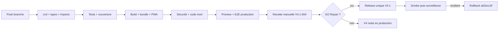

# Tests et release LearnX V4.1

## Stratégie

| Niveau | Objet | Outil |
| --- | --- | --- |
| Unitaire | règles, composants et contrats | Vitest + Testing Library React |
| Intégration | transactions, repositories, permissions et concurrence | Playwright/runner sur branche Neon jetable |
| E2E développement | routes, responsive, accessibilité et catalogues internes | Playwright multi-projets |
| E2E production | bundle livré, sans routes de design | Playwright production config |
| Statique | types, lint, imports, cycles et code mort | TypeScript, ESLint, contrôle imports, knip |
| Supply chain | vulnérabilités de production | `pnpm audit --prod` |

## Gates reproductibles

```bash
pnpm prisma:generate
pnpm lint
pnpm typecheck
pnpm test
pnpm test:coverage:v4.1
pnpm quality:coverage:critical
pnpm quality:dead-code
pnpm build
pnpm quality:bundle
pnpm quality:security
pnpm test:e2e:production
```

La chaîne consolidée est `pnpm quality:v4.1:final`. Elle exige 80 % sur les
quatre métriques globales et 90 % lines sur auth/accès,
correction/pricing/crédits/réconciliation, progression/évaluations et
autorisations admin.

## Environnements

- Vitest : jsdom et doubles typés ; aucun service payant.
- E2E local : API interceptée pour vérifier le navigateur.
- Intégration : branche Neon copy-on-write jetable, protégée par identifiants
  d'environnement ; suppression vérifiée après le run.
- Preview finale : configuration proche production, données de recette et
  secrets externes ; aucune donnée utilisateur réelle dans les fixtures.

## Pipeline CI et release



Le contexte externe `Quality / V4.1 final (required)` doit être rendu
obligatoire sur `dev` avant le GO. Le dépôt prouve le job, pas le réglage de
protection de branche.

## Recette obligatoire V4.1-504

1. Déployer le SHA candidat exact en preview et le consigner.
2. Rejouer demande d'accès, activation, connexion/déconnexion et permissions.
3. Parcourir Today → programme → étape → module → leçon, notes et révisions.
4. Rejouer exercice, devis, confirmation, résultat complet/partiel,
   contestation, historique et comparaison.
5. Vérifier réservation, règlement, libération et coût inconnu fail-close.
6. Contrôler crédits utilisateur et administration.
7. Installer la PWA sur appareil, tester offline/update.
8. Contrôler 320/390/720/1440/1920, zoom navigateur 200 %, clavier et lecteur
   d'écran ; aucune couleur comme seul signal.
9. Répéter un rollback vers `a02ecc3f…`, puis restaurer la preview candidate.
10. Enregistrer preuves, divergences et décision propriétaire.

## Budgets

- JavaScript initial ≤ 125 kB gzip ;
- CSS initial ≤ 25 kB gzip ;
- plus gros chunk lazy et précache sous les seuils versionnés du script bundle ;
- 0 vulnérabilité haute/critique ;
- 0 dette P0/P1 ; chaque P2 a owner, impact et cible.

## Rollback

V4.1 ne requiert pas de migration de données pour React/shadcn ou le découpage
Prisma. Le rollback applicatif redéploie la release V4
`a02ecc3f307af36656fa5cb8a7b62954fdec73e9`. Ne jamais utiliser un rollback
Git destructif sur un worktree local ; le déploiement cible un SHA immuable.

Pour la correction, suspendre les nouveaux dispatchs avant toute opération de
rollback si des tentatives restent `SENT`, `ORPHANED` ou sans coût. Réconcilier
chaque tentative avant règlement/libération définitifs.
