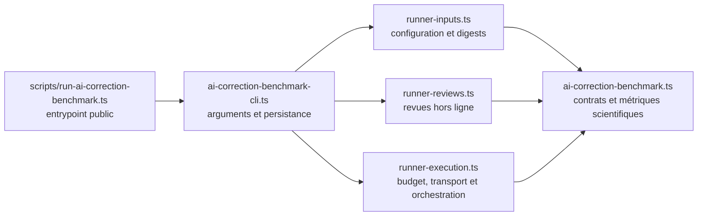

# V4.1-404 — séparation du runner de benchmark

## Statut du lot

- Périmètre : runner de benchmark de correction IA uniquement.
- Branche : `codex/v4-1-404-runner`.
- Commits d'implémentation : `9fdfca9f`, puis `bc130d61`.
- Réseau fournisseur : aucun appel réel effectué.
- Artefacts historiques : aucun fichier de résultat, manifeste ou digest réécrit.

## Frontière livrée

Le chemin de commande publié reste identique. Importer l'entrypoint ou le
barrel `ai-correction-benchmark-runner.ts` n'exécute ni CLI, ni réseau, ni
écriture.

## Invariants verrouillés

- mêmes options, erreurs et modes CLI ;
- mêmes configurations, corpus, identités et SHA-256 ;
- `--validate-only` reste hors ligne et ne nécessite aucune clé ;
- mêmes phases primary, retry, score guard et resume ;
- mêmes chemins, propriétés, ordre de sérialisation et terminaison de ligne
  pour les artefacts ;
- aucun seuil, gold, corpus, prompt, modèle ou adaptateur fournisseur modifié.

Les quatre configurations de référence sont figées dans
`src/lib/ai-correction-benchmark-runner-parity.test.ts`. Le test vérifie leurs
identités et digests exacts, le message validate-only et l'absence d'effet de
bord lors de l'import du script public.

## Dette résiduelle P2

Ce lot ne découpe volontairement pas la bibliothèque scientifique
`src/lib/ai-correction-benchmark.ts` (3 229 lignes) ni son fichier de tests
(4 098 lignes). Les modifier simultanément avec le raccord CLI aurait élargi
le risque sur les schémas, métriques et verdicts scientifiques.

Le reliquat doit être traité dans un ticket séparé après V4.1-404 : extraire
les schémas, la validation des preuves, les métriques, le resume et les revues
en modules couverts par des fixtures byte-for-byte. Cette dette est P2 : elle
ne bloque pas la séparation sûre library/CLI mais reste incompatible avec la
cible anti-monolithe finale tant qu'elle n'est pas résolue.
