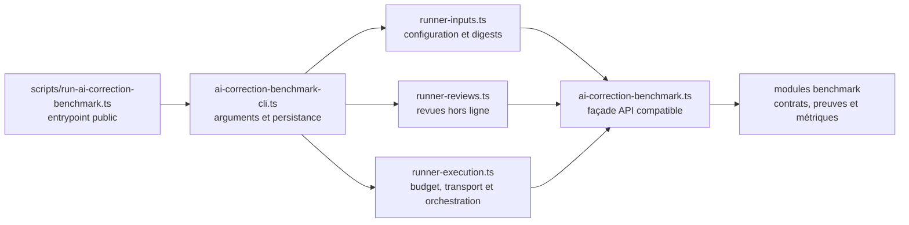

# V4.1-404 — séparation du runner de benchmark

## Statut du lot

- Périmètre : runner de benchmark de correction IA uniquement.
- Branche : `codex/v4-1-404-runner`.
- Commits d'implémentation : `9fdfca9f`, `bc130d61`, `f6cf7a64`,
  `9539d109`, `c13d9ac2` et `ffe43054`.
- Réseau fournisseur : aucun appel réel effectué.
- Artefacts historiques : aucun fichier de résultat, manifeste ou digest réécrit.

## Frontière livrée

Le chemin de commande publié et ses sept exports TypeScript historiques
restent identiques. Importer l'entrypoint ou le barrel
`ai-correction-benchmark-runner.ts` n'exécute ni CLI, ni réseau, ni écriture.
La façade scientifique conserve également sa liste exacte de 55 exports
historiques, dont 40 exports runtime ; ces deux contrats sont figés par test.

La façade scientifique conserve tous les exports historiques. Les domaines
configuration, corpus, preuves, revues, reprise, compatibilité et artefacts
sont désormais isolés. Le CLI, les entrées et l'exécution sont eux-mêmes
répartis en modules sous la cible de 400 lignes. L'ancienne suite unique de
4 098 lignes est remplacée par onze suites thématiques de moins de 600 lignes,
adossées à un support de test commun.

## Invariants verrouillés

- mêmes options, erreurs et modes CLI ;
- mêmes configurations, corpus, identités et SHA-256 ;
- `--validate-only` reste hors ligne et ne nécessite aucune clé ;
- mêmes phases primary, retry, score guard et resume ;
- mêmes chemins, propriétés, ordre de sérialisation et terminaison de ligne
  pour les artefacts ;
- aucun seuil, gold, corpus, prompt, modèle ou adaptateur fournisseur modifié.

Les quatre configurations de référence sont figées dans
`src/lib/ai-correction-benchmark-runner-parity.test.ts`. Le test vérifie leurs
identités et digests exacts, le message validate-only et l'absence d'effet de
bord lors de l'import du script public.

## Preuves de parité

- tests ciblés : 13 fichiers et 92 tests verts, dont parité CLI/library et
  import runtime sans effet de bord ;
- suite complète : 183 fichiers et 1 065 tests verts ;
- `lint`, `typecheck` et `build` verts ;
- les quatre commandes `--validate-only` retournent exactement
  `Benchmark validé hors ligne : 24 cas, 12 modèles épinglés.` ;
- le préflight writing sous plafond de 4 USD est identique octet par octet à
  la baseline : SHA-256
  `5bef5d1a646470f9ca1ad353f0ab55e4dc27644a53e63fd2e2321b7f243bdc88`,
  `cmp = 0` ;
- aucun appel réseau ou fournisseur n'a été réalisé.

## Dette résiduelle P2

Le seul hotspot benchmark écrit à la main encore au-dessus de 400 lignes est
`src/lib/ai-correction-benchmark-summary.ts` (1 021 lignes). Il regroupe le
noyau d'agrégation scientifique où l'ordre des calculs, l'accumulation
numérique et l'application des gates sont interdépendants.

Cette exception est enregistrée dans `V4_1_BACKLOG.md` comme `V4.1-404-R1`,
priorité P2, owner Architecture/Produit et cible V4.1-503. Son découpage devra
être précédé de goldens ciblés sur chaque
sous-agrégat et conserver l'ordre exact des calculs. Il n'est pas opportun de
le morceler mécaniquement dans ce lot au risque de modifier silencieusement
les métriques ou verdicts. Les fichiers de tests dépassant 400 lignes restent
tous sous la cible dédiée de 600 lignes.
